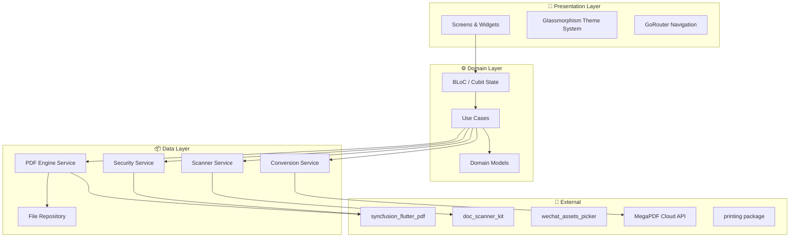

# All-in-One PDF Suite — Flutter Implementation Plan

A comprehensive mobile PDF utility consolidating document creation, advanced editing, conversion, and security into a single premium platform with a dark glassmorphism UI.

---

## User Review Required

> [!IMPORTANT]
> **Cloud API for Format Conversion**: High-fidelity PDF → Word/PPT conversion cannot be done reliably on-device. The plan includes a lightweight backend proxy using the **MegaPDF API** (or similar). This means:
> - Users will need internet connectivity for format conversions
> - You'll need an API key (MegaPDF has a free tier)
> - **Alternative**: We can implement a text-extraction-only offline fallback that won't preserve formatting
>
> **Please confirm if cloud-based conversion is acceptable, or if you want offline-only (with quality tradeoffs).**

> [!WARNING]
> **Syncfusion Licensing**: Several features (PDF text editing, encryption, annotations) are best served by `syncfusion_flutter_pdf`. Syncfusion offers a **free Community License** for individuals and small businesses (<$1M revenue, <5 developers). If you don't qualify, an alternative open-source stack is provided below but with reduced capability.

## Open Questions

1. **App Name**: The concept doc says "All-in-One PDF" — is this the final app name, or do you have a specific brand name in mind?
2. **Target Platforms**: Android only, iOS only, or both? This affects scanner package selection.
3. **Monetization**: Free with ads? Freemium? One-time purchase? This impacts architecture (ad SDK integration, feature gating).
4. **Backend Preference**: For the PDF → Word/PPT conversion API, do you have a preferred service, or should I set up a generic integration layer?
5. **State Management**: I'm planning **BLoC/Cubit** (industry standard for production Flutter apps). Any preference for Riverpod or Provider instead?

---

## Architecture Overview



---

## Package Selection

| Feature | Package | Role | License |
|:---|:---|:---|:---|
| **PDF Generation** | `pdf` (dart) | Create PDFs from images/text | Apache 2.0 |
| **PDF Viewing** | `pdfrx` | High-performance PDF renderer | MIT |
| **PDF Editing/Security** | `syncfusion_flutter_pdf` | Text/image editing, encryption, annotations | Community Free |
| **Document Scanning** | `doc_scanner_kit` | Native camera scanner with auto-crop | MIT |
| **Bulk Image Picker** | `wechat_assets_picker` | Select up to 500 images efficiently | Apache 2.0 |
| **Image Compression** | `flutter_image_compress` | Compress before PDF conversion | MIT |
| **PDF → Word/PPT** | `megapdf_flutter` (cloud) | Format conversion API | API Key |
| **PDF → Images** | `pdfrx` | Render pages as images | MIT |
| **Printing** | `printing` | Cross-platform print support | Apache 2.0 |
| **Navigation** | `go_router` | Declarative routing | BSD |
| **State Management** | `flutter_bloc` | BLoC pattern | MIT |
| **Local Storage** | `path_provider` + `hive` | File management & metadata cache | MIT/Apache |
| **File Sharing** | `share_plus` | System share sheet | BSD |
| **Permissions** | `permission_handler` | Camera, storage permissions | MIT |
| **Animations** | `flutter_animate` | Micro-animations | MIT |

---

## UI/UX Design System

### Color Palette

```
Background (Primary):    #0D0D0D  (near-black)
Background (Secondary):  #1A1A1A  (dark gray)
Surface (Glass):         #FFFFFF @ 8-12% opacity
Glass Border:            #FFFFFF @ 15-20% opacity
Red Trim:                #FF2D2D  (interactive borders)
Orange Accent:           #FF6B2C  (CTAs, selected states)
Orange Glow:             #FF8C42  (hover/active glow)
Text Primary:            #FFFFFF
Text Secondary:          #A0A0A0
Text Muted:              #666666
Success:                 #00E676
Error:                   #FF5252
```

### Glass Card Component Spec

```
┌─────────────────────────────────┐
│  Border: 1px #FFFFFF @ 15%      │
│  Background: #FFFFFF @ 10%      │
│  Blur: BackdropFilter σ=12      │
│  Border-radius: 16px            │
│  Shadow: 0 8px 32px #000 @ 25%  │
└─────────────────────────────────┘
```

### Typography (Google Fonts: **Inter**)

| Style | Weight | Size | Usage |
|:---|:---|:---|:---|
| Display | 700 | 28px | Screen titles |
| Headline | 600 | 22px | Section headers |
| Title | 600 | 18px | Card titles |
| Body | 400 | 16px | General text |
| Label | 500 | 14px | Buttons, tabs |
| Caption | 400 | 12px | Metadata, hints |

### Key UI Patterns

- **Bottom Navigation**: 5-tab glass bar with red trim outline, orange fill for active tab
- **Feature Cards**: Glassmorphic cards with red border on hover/tap, orange icon accents
- **Floating Action Button**: Orange gradient with glow effect
- **Progress Indicators**: Orange-to-red gradient progress bars for bulk operations
- **Modals/Sheets**: Full-glass bottom sheets with drag handle

---

## Proposed Changes — Phased Implementation

### Phase 1: Project Scaffold & Design System

#### [NEW] Flutter project initialization
```bash
flutter create --org com.allinonepdf --project-name allinonepdf ./
```

#### [NEW] [pubspec.yaml](file:///c:/Users/masoo/OneDrive/Desktop/Projects_2026/allinonepdf/pubspec.yaml)
- Configure all dependencies listed in the package table above
- Set minimum SDK constraints (Flutter 3.22+, Dart 3.4+)
- Configure asset directories for fonts and icons

#### [NEW] lib/core/theme/
- `app_colors.dart` — Full color palette constants
- `app_theme.dart` — ThemeData with dark glassmorphism defaults
- `app_typography.dart` — Text styles using Inter font
- `glass_morphism.dart` — Reusable `GlassCard`, `GlassContainer`, `GlassBottomSheet` widgets

#### [NEW] lib/core/widgets/
- `animated_icon_button.dart` — Tap-scale icon buttons with orange glow
- `gradient_button.dart` — Orange gradient CTA button
- `progress_overlay.dart` — Full-screen processing overlay with animated progress
- `glass_app_bar.dart` — Custom translucent app bar
- `glass_bottom_nav.dart` — 5-tab bottom navigation with red trim

#### [NEW] lib/core/router/
- `app_router.dart` — GoRouter configuration with all routes
- Route transitions using slide/fade animations

---

### Phase 2: Home Screen & Navigation Shell

#### [NEW] lib/features/home/
- `home_screen.dart` — Main dashboard with feature grid
- `recent_documents_section.dart` — Recently opened/created PDFs
- `quick_actions_bar.dart` — Camera scan, import, create shortcuts

#### [NEW] lib/features/shell/
- `app_shell.dart` — Scaffold with glass bottom nav, nested navigation

**Screen Layout:**
```
┌──────────────────────────────┐
│  Glass AppBar: "AllInOnePDF"  │
│  ┌──────────────────────────┐ │
│  │   Quick Actions Row      │ │
│  │  📷  📁  ➕  🔒         │ │
│  └──────────────────────────┘ │
│  ┌──────────────────────────┐ │
│  │   Recent Documents       │ │
│  │   ┌────┐ ┌────┐ ┌────┐  │ │
│  │   │PDF1│ │PDF2│ │PDF3│  │ │
│  │   └────┘ └────┘ └────┘  │ │
│  └──────────────────────────┘ │
│  ┌──────────────────────────┐ │
│  │   Feature Grid (2x3)     │ │
│  │   🔄Convert  ✂️Edit      │ │
│  │   📸Scan     🔒Lock      │ │
│  │   🖨️Print    📤Share     │ │
│  └──────────────────────────┘ │
│══════════════════════════════│
│  🏠  📄  ➕  🔒  ⚙️        │
│  Home Docs Create Secure Set │
└──────────────────────────────┘
```

---

### Phase 3: Document Creation & Capture

#### [NEW] lib/features/create/
- `create_pdf_screen.dart` — Entry point for PDF creation
- `bulk_import_screen.dart` — Gallery picker (wechat_assets_picker) with progress
- `image_preview_grid.dart` — Reorderable grid of selected images with thumbnails
- `scan_document_screen.dart` — Camera scanner integration (doc_scanner_kit)
- `processing_screen.dart` — Bulk conversion progress with isolate processing

#### [NEW] lib/services/pdf_creation_service.dart
- `imagesToPdf(List<File> images)` — Converts images to PDF using `pdf` package
- Runs in background isolate via `Isolate.run()`
- Chunked processing: processes 10 images at a time to manage memory
- Supports 20 formats: JPG, JPEG, PNG, BMP, GIF, TIFF, TIF, WEBP, HEIC, HEIF, SVG, ICO, RAW, CR2, NEF, ARW, DNG, PSD, AI, EPS

#### [NEW] lib/services/scanner_service.dart
- Wraps `doc_scanner_kit` with auto-crop, perspective correction, enhancement
- Returns processed images ready for PDF insertion

---

### Phase 4: PDF Viewing & Editing

#### [NEW] lib/features/viewer/
- `pdf_viewer_screen.dart` — Full PDF viewer using `pdfrx`
- `page_thumbnail_strip.dart` — Horizontal scrollable page thumbnails at bottom
- `annotation_toolbar.dart` — Floating toolbar for highlights, underlines, text

#### [NEW] lib/features/editor/
- `pdf_editor_screen.dart` — Page management (reorder, add, extract, delete)
- `page_reorder_grid.dart` — Drag-and-drop page reordering
- `text_edit_overlay.dart` — Inline text editing overlay
- `image_insert_dialog.dart` — Pick and position new images on pages
- `annotation_layer.dart` — Highlight, underline, text annotation rendering

#### [NEW] lib/services/pdf_editor_service.dart
- Uses `syncfusion_flutter_pdf` for:
  - Page extraction/insertion/reordering
  - Text addition/removal
  - Image insertion
  - Highlight/underline annotations
- File-based operations (load → modify → save)

---

### Phase 5: Export & Conversion

#### [NEW] lib/features/export/
- `export_screen.dart` — Canva-style page selection UI
- `page_selector_grid.dart` — Tap-to-select pages with orange highlight
- `format_picker_sheet.dart` — Bottom sheet to choose export format
- `export_progress_screen.dart` — Conversion progress with cancel option

#### [NEW] lib/services/conversion_service.dart
- **PDF → Images**: Uses `pdfrx` to render individual pages as PNG/JPG
- **PDF → Word**: Calls MegaPDF API (or custom backend)
- **PDF → PPT**: Calls MegaPDF API (or custom backend)
- **Selective Export**: Extracts selected pages first, then converts

**Canva-Style Page Selector:**
```
┌──────────────────────────────┐
│  Select Pages to Export       │
│  ┌──────┐ ┌──────┐ ┌──────┐ │
│  │  ☑️  │ │  ☐   │ │  ☑️  │ │
│  │ Pg 1 │ │ Pg 2 │ │ Pg 3 │ │
│  │orange│ │ dim  │ │orange│ │
│  │border│ │      │ │border│ │
│  └──────┘ └──────┘ └──────┘ │
│  ┌──────┐ ┌──────┐ ┌──────┐ │
│  │  ☐   │ │  ☑️  │ │  ☐   │ │
│  │ Pg 4 │ │ Pg 5 │ │ Pg 6 │ │
│  └──────┘ └──────┘ └──────┘ │
│                              │
│  ┌────────────────────────┐  │
│  │  Export as: [Word ▼]   │  │
│  │  ██████████████ 100%   │  │
│  │  [  Export Selected  ] │  │
│  └────────────────────────┘  │
└──────────────────────────────┘
```

---

### Phase 6: Security & Printing

#### [NEW] lib/features/security/
- `pdf_locker_screen.dart` — Set/remove password protection
- `password_input_sheet.dart` — Secure password entry with strength indicator
- `locked_documents_list.dart` — View all encrypted PDFs

#### [NEW] lib/features/print/
- `print_preview_screen.dart` — Print preview using `printing` package
- Supports wireless (AirPrint/Android Print) and USB-connected printers
- Page range selection before printing

#### [NEW] lib/services/security_service.dart
- Uses `syncfusion_flutter_pdf` for AES-256 encryption
- Set user password (to open) and owner password (to restrict)
- Permission flags: print, copy, edit

#### [NEW] lib/services/print_service.dart
- Wraps `printing` package
- Single-tap print with format auto-detection

---

## Project Structure

```
lib/
├── main.dart
├── app.dart
├── core/
│   ├── theme/
│   │   ├── app_colors.dart
│   │   ├── app_theme.dart
│   │   ├── app_typography.dart
│   │   └── glass_morphism.dart
│   ├── widgets/
│   │   ├── animated_icon_button.dart
│   │   ├── gradient_button.dart
│   │   ├── progress_overlay.dart
│   │   ├── glass_app_bar.dart
│   │   ├── glass_bottom_nav.dart
│   │   └── empty_state.dart
│   ├── router/
│   │   └── app_router.dart
│   ├── constants/
│   │   └── app_constants.dart
│   └── utils/
│       ├── file_utils.dart
│       └── image_utils.dart
├── features/
│   ├── home/
│   │   ├── bloc/
│   │   ├── screens/
│   │   └── widgets/
│   ├── create/
│   │   ├── bloc/
│   │   ├── screens/
│   │   └── widgets/
│   ├── viewer/
│   │   ├── bloc/
│   │   ├── screens/
│   │   └── widgets/
│   ├── editor/
│   │   ├── bloc/
│   │   ├── screens/
│   │   └── widgets/
│   ├── export/
│   │   ├── bloc/
│   │   ├── screens/
│   │   └── widgets/
│   ├── security/
│   │   ├── bloc/
│   │   ├── screens/
│   │   └── widgets/
│   └── print/
│       ├── bloc/
│       ├── screens/
│       └── widgets/
├── services/
│   ├── pdf_creation_service.dart
│   ├── pdf_editor_service.dart
│   ├── scanner_service.dart
│   ├── conversion_service.dart
│   ├── security_service.dart
│   └── print_service.dart
└── models/
    ├── pdf_document.dart
    ├── pdf_page.dart
    └── export_options.dart
```

---

## Verification Plan

### Automated Tests
- Unit tests for all service classes (PDF creation, conversion, security)
- Widget tests for glass theme components
- Integration tests for the bulk image → PDF pipeline
- `flutter analyze` for lint-free code

### Manual Verification
- Run on Android emulator (API 34+) to verify:
  - Glassmorphism rendering performance
  - Bulk import with 50+ images (device memory test)
  - Scanner auto-crop quality
  - PDF viewing/editing workflow
  - Export page selection UX
  - Password protection round-trip (lock → unlock)
  - Print preview rendering
- Run on iOS simulator (if targeting iOS)

### Browser-Based Demo
- Verify the app launches cleanly with `flutter run`
- Walk through the complete user journey: Create → Edit → Export → Lock → Print
